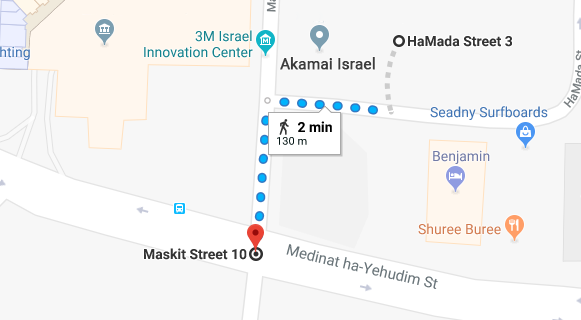

Owntracks (GPS Tracker)
=======================

Owntracks is an open source project that provides iOS and Android apps that can track your smartphone location.
While being somewhat useful for some personnel, it can be severely misconfigured. The tracking messages can be published
to public MQTT brokers, and by that available to all.

Message Structure
-----------------

Those publicly sent messages have a certain format:

.. code-block:: json
    :emphasize-lines: 7,8
    :linenos:

    {
        "_type": "location",
        "tid": "n5",
        "acc": 17,
        "batt": 80,
        "conn": "m",
        "lat": -22.983600,
        "lon": -43.2178200,
        "t": "c",
        "tst": 1532102000
    }

The more interesting lines are `7` and `8`, they contain the longitude and latitude of the user.

Usage
-----

The :code:`owntracks` plugin utilities all information above to aggregate those tracking messages to create a single
google maps URL that contains the route the client did. First, make sure you have selected a scan. Let's see the help
strings for this plugins:

.. code-block:: shell

    [Scan #1] >> owntracks --help
    usage: owntracks [-h] [-u USER] [-d DEVICE]

    Owntracks shares publicly their users coordinates. Simply discover some
    topics, choose that scan and pick a user+device to look for.

    optional arguments:
      -h, --help            show this help message and exit
      -u USER, --user USER  user to find owntracks coordinates
      -d DEVICE, --device DEVICE
                            device to find owntracks coordinates

We can see that the plugin expects a `user` and `device` strings. Well, how do we get them? Simply run the
:code:`owntracks` plugin without any argument:

.. code-block:: shell

    [Scan #1] >> owntracks
    +------------+--------------------------------------+----------+
    |    User    |                Device                | # Coords |
    +------------+--------------------------------------+----------+
    |   daniel   |               iPhone7                |    2     |
    |   moshe    |               GalaxyS9               |    1     |
    +------------+--------------------------------------+----------+

We got a table, containing the `users` and `devices` that we got, along with the number of coordinates for each couple.
Now, let's run the plugin with the `user` and `device` arguments:

.. code-block:: shell

    [Scan #1] >> owntracks -u "daniel" -d "iPhone7"
    [+] Google Maps Url: https://www.google.com/maps/dir/32.1666157,34.8123043/32.1657401,34.8116074

And voilà! We have our tracked user and device route:

